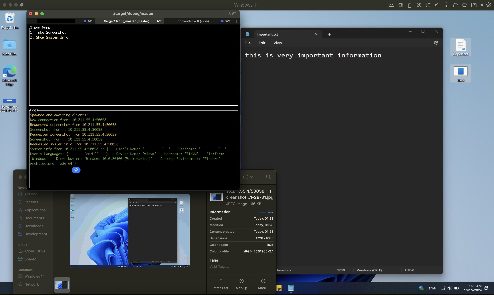

# spyctl 🕵️‍♂️

A cross-platform surveillance control system built with Rust.

## 🚀 Features

- Spy features (WIP): screen capture
- Websocket communication between master and slave
- Customizable surveillance state
- File system integration for storing screenshots



## 🚦 Getting Started

- Set the correct IP for master server in `src/bin/slave.rs`.
- Run `cargo build --release` to build the project.
- The `./target/release/master` and `./target/release/slave` executables will be generated.
- Run the `master` executable on the master machine and the `slave` executable on the slave machine.

Need to cross compile for another OS? Use the fantastic [Cross](https://github.com/cross-rs/cross) tool! E.g:

```bash
cargo install cross --git https://github.com/cross-rs/cross
cross build --bin slave --release --target x86_64-pc-windows-gnu
```

## Todo

- [x] 🕸️ Create a master server accepting many slaves WebSocket communcation system
- [x] 📺 Add screenshot capture functionality with multiple displays and auto encoding to JPEG
- [x] 🖥️ Add a nice TUI to interact with slaves
- [ ] 🖥️ Migrate from TUI to egui to interact with slaves
- [ ] 🔕 Make slave completely silent (remove any visible trace of running)
- [ ] 📦 Add a build script for easy build/deployment, taking in master IP
- [ ] 🤖 Make slave install itself persistently
- [ ] 📸 Add webcam capture functionality
- [ ] ⌨️ Add a keylogger
- [ ] 🔒 Implement encryption for data transfer
- [ ] 🎤 Add microphone capture functionality

## 🔐 Security Note

This project is for educational purposes only. Always ensure you have proper authorization before deploying any surveillance software. This is made for fun and learning, not for malicious activities.

## 🤝 Contributing

Contributions, issues, and feature requests are welcome!

## 📬 Contact

Feel free to contact me if you have any questions or suggestions.
